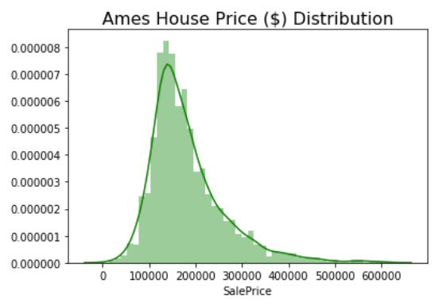
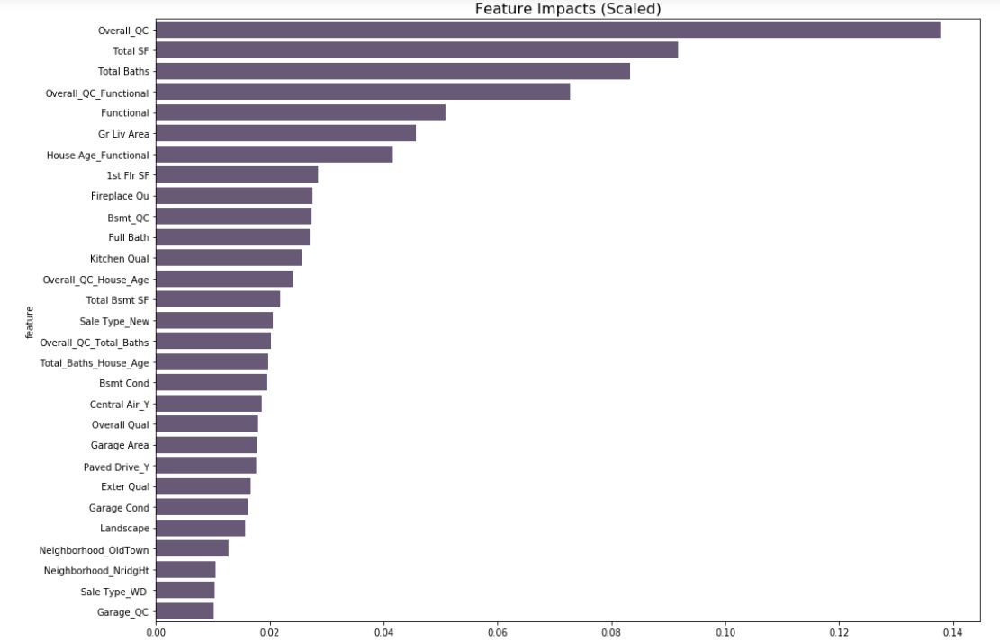
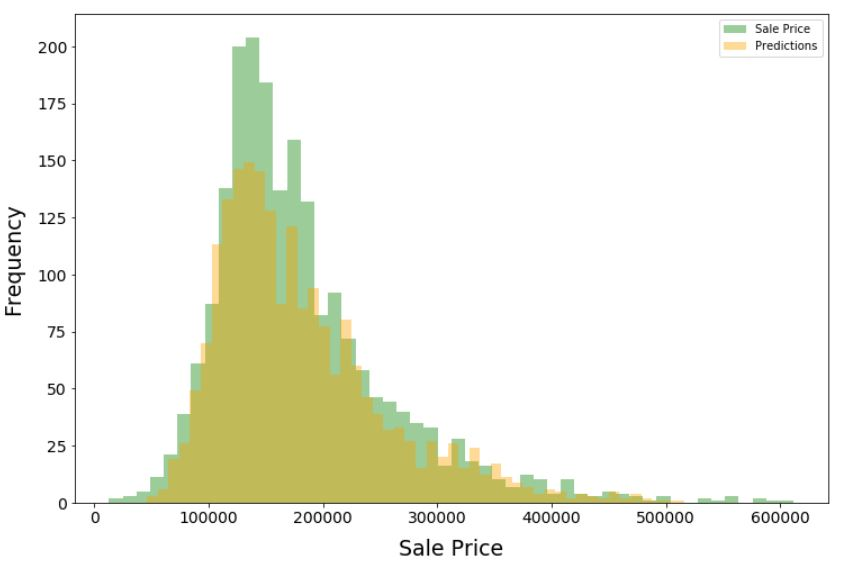

# Project 2 - Ames Housing Data and Kaggle Challenge

## 1) Introduction

This project is focused on creating a regression model based on the Ames Housing Dataset in order to predict house prices for interested buyers and sellers. Since market value of a house is more than its square footage and location, we would like to find out all features that add value to a house. The success of the model will be evaluated on unseen data provided on Kaggle.

Data set contains information from the Ames Assessor’s Office used in computing assessed values for individual residential properties sold in Ames, IA from 2006 to 2010. There are 2930 observations and 82 variables:

23 nominal
23 ordinal
14 discrete
20 continuous
2 identifier

The variables can roughly fall under each of below categories:

Location
Area measurements
Lot / Land
Age
Appearance
Roof
Garage
Kitchen
Rooms / Bathrooms
Utilities
External (Deck, pool, porch etc.)

**Sale Price Distribution**

It's almost a normal distribution with a slight positive skewness due to outliers. It shows that very small number of houses have high pricess. As we want our target variable as normal as possible, it is a good idea to apply log transformation which reduces the impact of positive skewness.

Log Price Distribution

## 2) Data Cleaning & EDA

There are 5 types of functions applied to impute missing values based on data type:

- Replace with "None" (categorical variables)
- Replace with 0 (numerical variables)
- Replace with median (year variables)
- Replace with median grouped by neighborhood (Lot Frontage)
- Replace with mode (Electrical)

After imputing missing values, removing few outliers, dummying nominal categories, mapping/scoring ordinal categories, creating interaction terms etc, I've come up with approximately 60 features.

## 3) Modeling

There are various quantitative fields with different unit measurements (sqft, age, number of rooms etc.). I used Standard Scaler to optimize their weight coefficients, and finally used Ridge and Lasso models to find out the most relevant features from my features list.

** Most Relevant Features**

1) Overall Quality * Condition
2) Total Square Footage
3) Total Number of Bathrooms
4) Overall Quality * Condition * Functional
5) Functional
5) Ground Living Area
6) House Age * Functional
7) 1st Floor Square Footage
8) Fireplace Quality
9) Basement Quality * Condition
10) Full Bathrooms
11) Kitchen Quality
12) Overall Quality * House Age
13) Total Basement Square Footage
14) Sale Type_New (Boolean)
15) Overall Quality * Condition * Total Baths
16) Total Baths * House Age
17) Basement Condition
18) Central Air_Yes (Boolean)
19) Overall Quality
20) Garage Area
21) Paved Drive_Yes (Boolean)
22) External Quality
23) Garage Condition
24) Lot Shape * Land Slope
25) Neighborhood_Old Town (Boolean)
26) Neighborhood_NridgHt (Boolean)
27) Sale Type_WD
28) Garage Quality * Condition

The model performed in a way that 91.6% variance on train data, 89.8% on test data could be explained by final model. When I submitted the unseen data result to Kaggle for evaluation, the root mean square error was $23,463.

**Actual Price vs Predictions Distribution**

## 3) Summary

Market value of a house is dependent on various factors and these factors vary based on economical situation and geographical location. We cannot fully generalize these factors but we can come up with closest predictions when sufficient amount of time, sample data, subject matter expertise, and statistical knowledge are available.
This model has been produced for our tech startup company "Pillow Predictions" to provide house value prediction service for interested buyers and sellers and still work in progress with a goal to build best model in the market.

